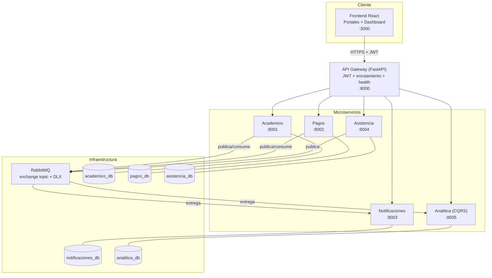

# Diagrama de arquitectura — CampusConnect 360

Vista de componentes del ecosistema. El navegador solo habla con el **API
Gateway**, que autentica (JWT) y enruta a los microservicios. Los servicios se
comunican de forma asíncrona por **RabbitMQ** (eventos). Cada servicio tiene su
propia base de datos.

## Responsabilidades

| Componente | Responsabilidad |
|------------|-----------------|
| Frontend | Interfaces funcionales (3 portales + dashboard) |
| API Gateway | Entrada única, autenticación JWT, enrutamiento, health agregado |
| Académico | Estudiantes y matrículas; publica `StudentEnrolled` |
| Pagos | Deudas y pagos; publica `PaymentConfirmed` |
| Asistencia | Asistencia e incidentes; publica `AttendanceRecorded`, `IncidentReported` |
| Notificaciones | Consume eventos (Pub/Sub), genera notificaciones, maneja DLQ |
| Analítica | Proyección CQRS para el dashboard |
| RabbitMQ | Canal de mensajes (exchange topic) + Dead Letter Exchange |
| PostgreSQL | Una base de datos por servicio (persistencia separada) |
