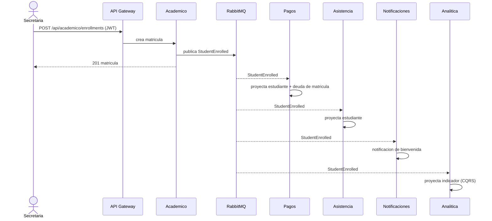
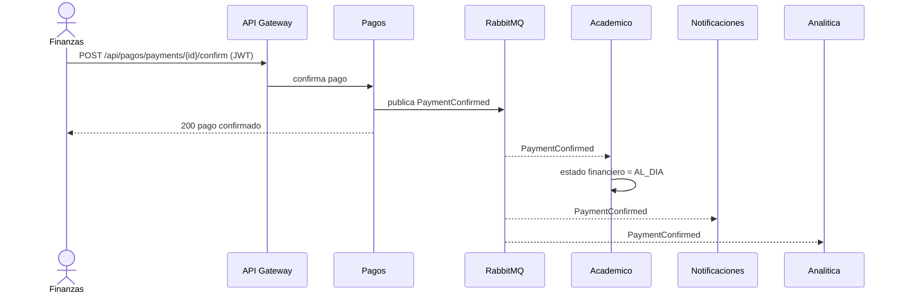
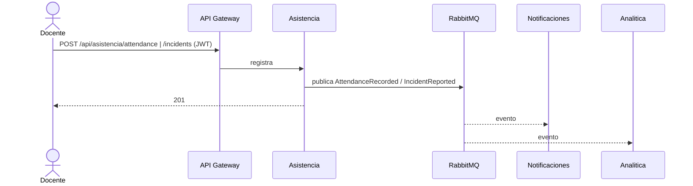
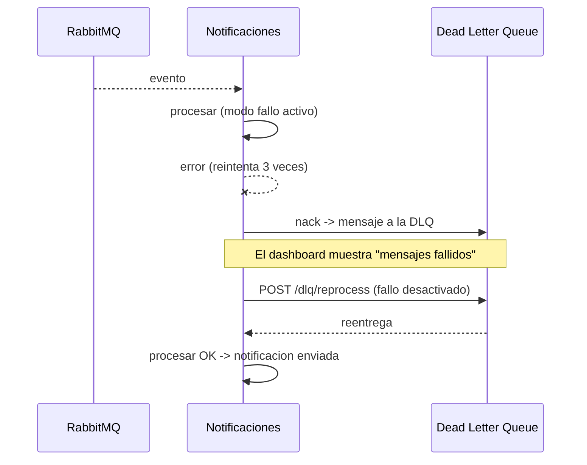

# Diagramas de flujo de eventos — CampusConnect 360

## 1. Registro y matrícula (`StudentEnrolled`)

Un mismo evento es consumido por varios servicios (Publish/Subscribe).

## 2. Confirmación de pago (`PaymentConfirmed`)

## 3. Asistencia / incidente (`AttendanceRecorded`, `IncidentReported`)

## 4. Escenario de resiliencia (fallo → DLQ → reprocesamiento)

