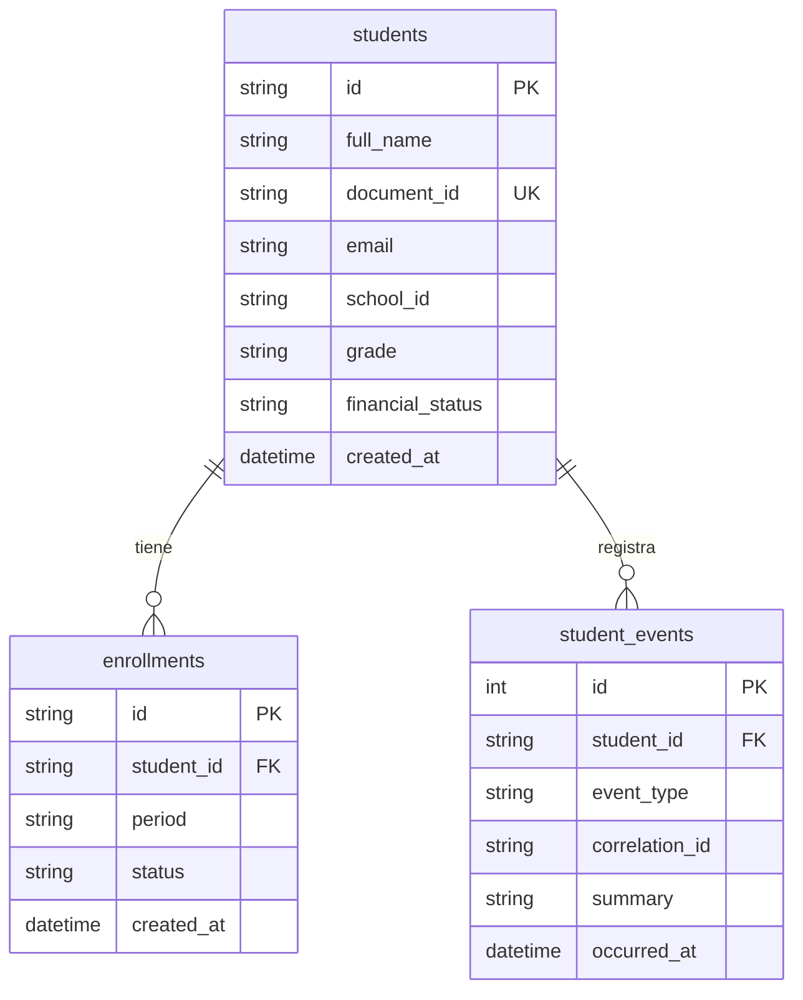
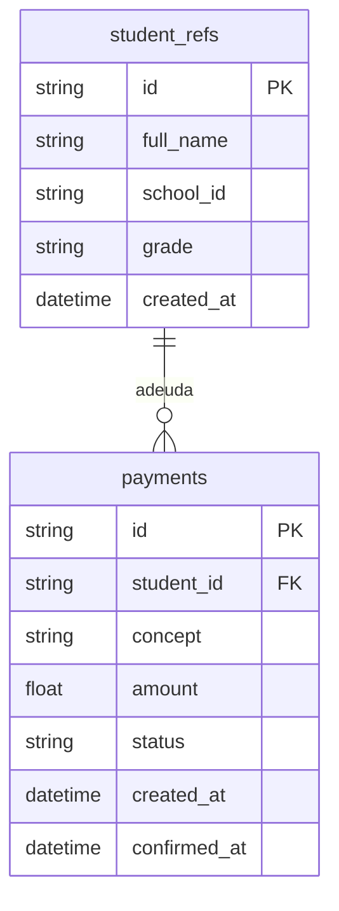
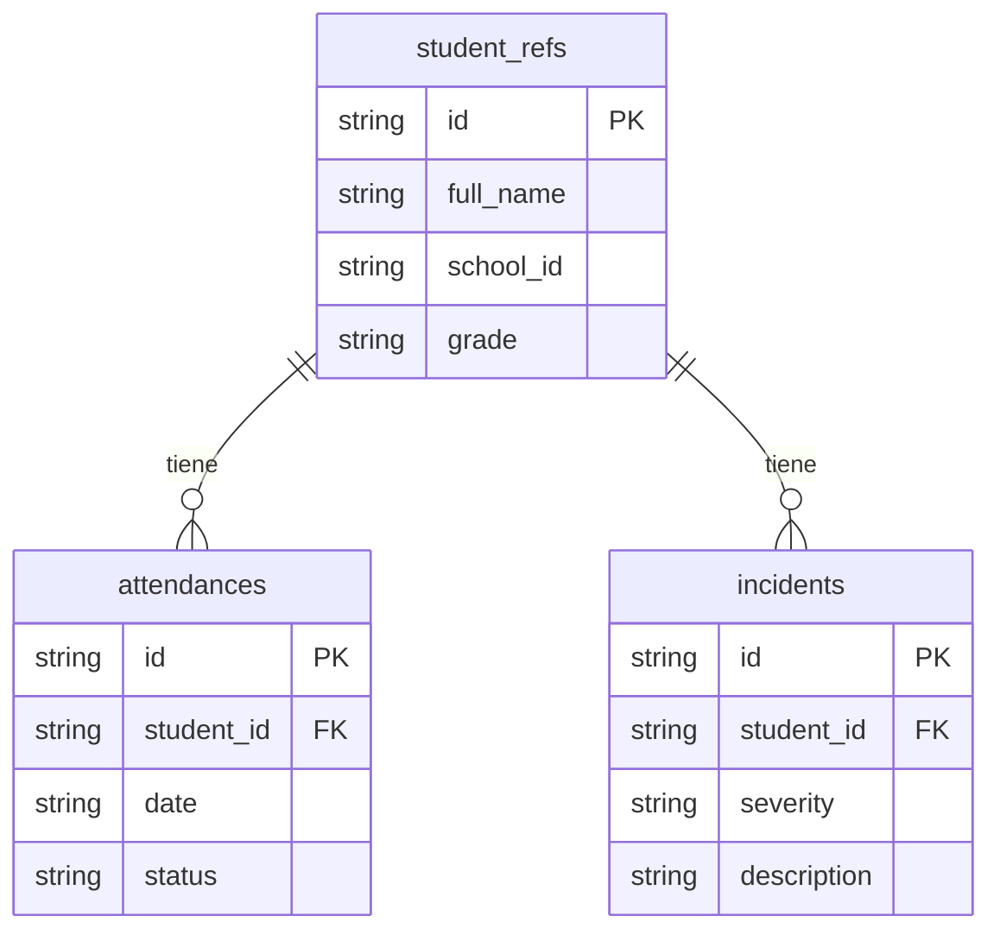
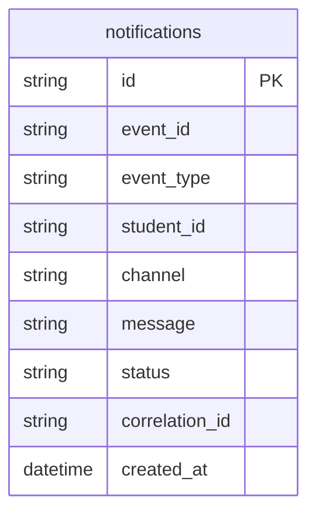
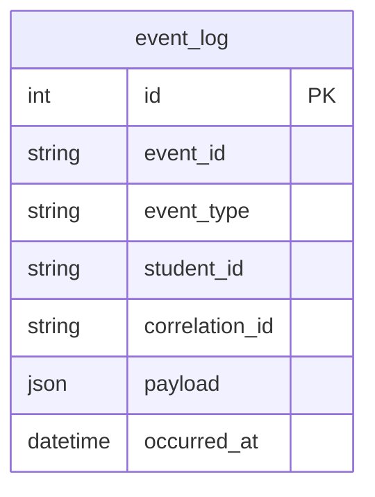
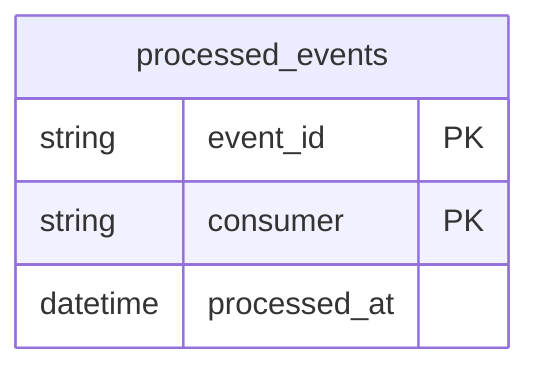

# Modelo de datos — CampusConnect 360

Cada microservicio es dueño de su propio esquema (base de datos independiente).
Los servicios que necesitan datos de estudiantes mantienen una **proyección
local** (`StudentRef`) alimentada por el evento `StudentEnrolled`, evitando el
acoplamiento directo entre bases de datos.

Todos los servicios que consumen eventos incluyen además la tabla
`processed_events` (Idempotent Receiver).

## Servicio Académico (`academico_db`)

## Servicio de Pagos (`pagos_db`)

## Servicio de Asistencia (`asistencia_db`)

## Servicio de Notificaciones (`notificaciones_db`)

## Servicio de Analítica (`analitica_db`) — modelo de lectura (CQRS)

## Tabla común de idempotencia (en cada servicio consumidor)

