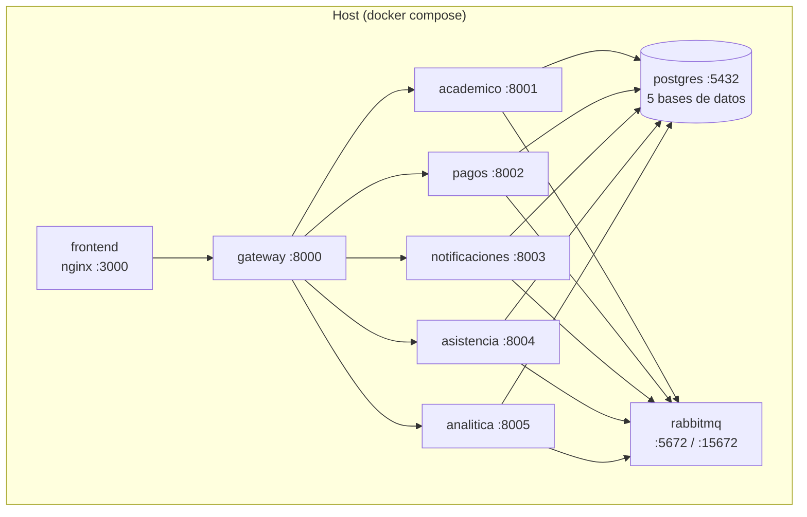
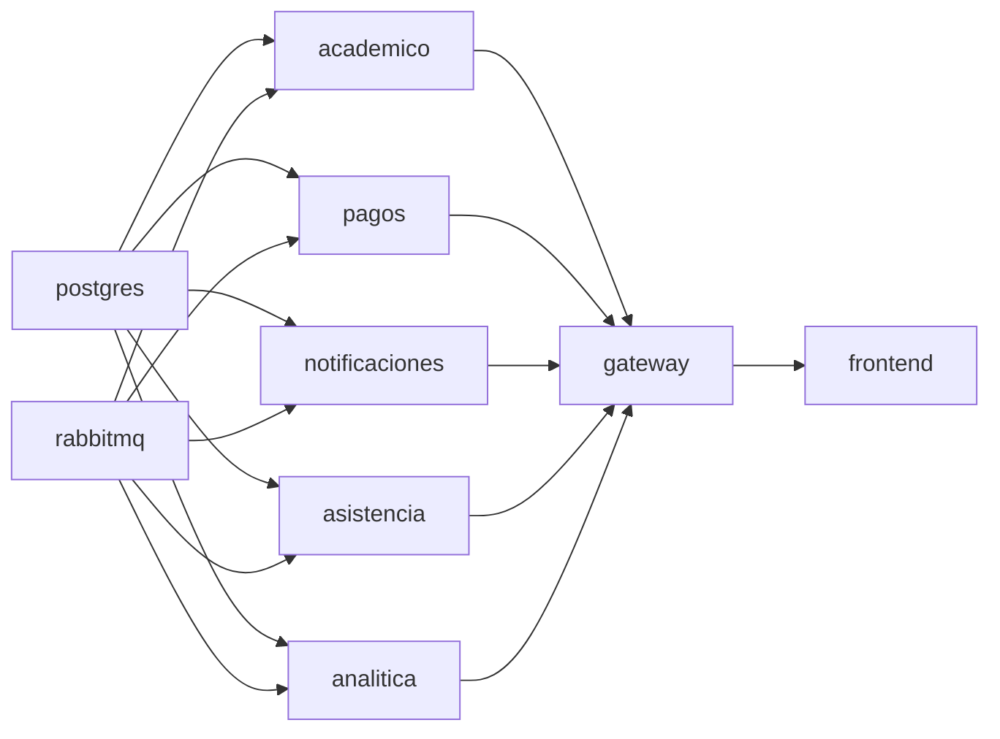

# Diagrama de despliegue — CampusConnect 360

Todo el ecosistema se orquesta con **Docker Compose**. Cada componente es un
contenedor; PostgreSQL y RabbitMQ son la infraestructura compartida.

## Puertos publicados

| Servicio | Puerto host |
|----------|-------------|
| frontend | 3000 |
| gateway | 8000 |
| academico / pagos / notificaciones / asistencia / analitica | 8001–8005 |
| postgres | 5432 |
| rabbitmq (AMQP / panel) | 5672 / 15672 |

## Orden de arranque (dependencias)

Los servicios esperan a que PostgreSQL y RabbitMQ estén *healthy* antes de
arrancar (definido con `depends_on` + `healthcheck` en `docker-compose.yml`).
